# Zephyre Architecture Diagrams (Mermaid)

This document contains all architectural diagrams for the Zephyre e-commerce platform in Mermaid format.

---

## 1. System Architecture Overview

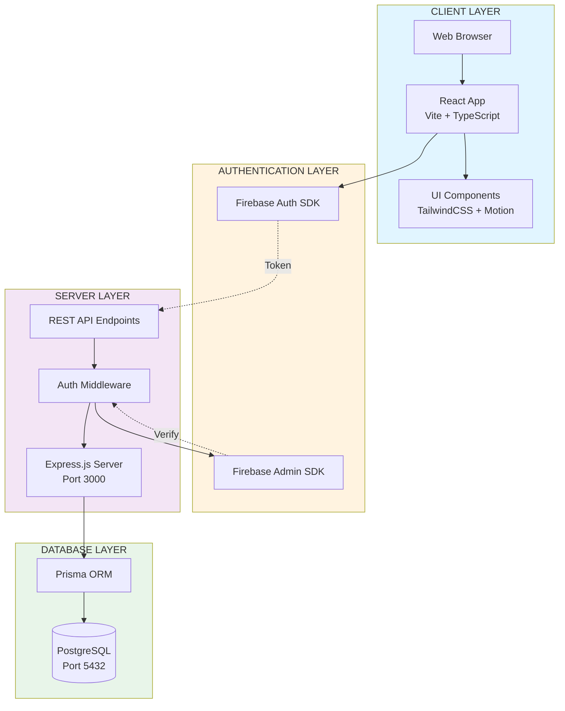
```mermaid
graph TB
    subgraph Client["CLIENT LAYER"]
        Browser[Web Browser]
        React[React App<br/>Vite + TypeScript]
        UI[UI Components<br/>TailwindCSS + Motion]
    end
    
    subgraph Auth["AUTHENTICATION LAYER"]
        FirebaseAuth[Firebase Auth SDK]
        FirebaseAdmin[Firebase Admin SDK]
    end
    
    subgraph Server["SERVER LAYER"]
        Express[Express.js Server<br/>Port 3000]
        API[REST API Endpoints]
        Middleware[Auth Middleware]
    end
    
    subgraph Database["DATABASE LAYER"]
        Prisma[Prisma ORM]
        PostgreSQL[(PostgreSQL<br/>Port 5432)]
    end
    
    Browser --> React
    React --> UI
    React --> FirebaseAuth
    FirebaseAuth -.Token.-> API
    API --> Middleware
    Middleware --> FirebaseAdmin
    FirebaseAdmin -.Verify.-> Middleware
    Middleware --> Express
    Express --> Prisma
    Prisma --> PostgreSQL
    
    style Client fill:#e1f5ff
    style Auth fill:#fff3e0
    style Server fill:#f3e5f5
    style Database fill:#e8f5e9
```

---

## 2. User Authentication Flow

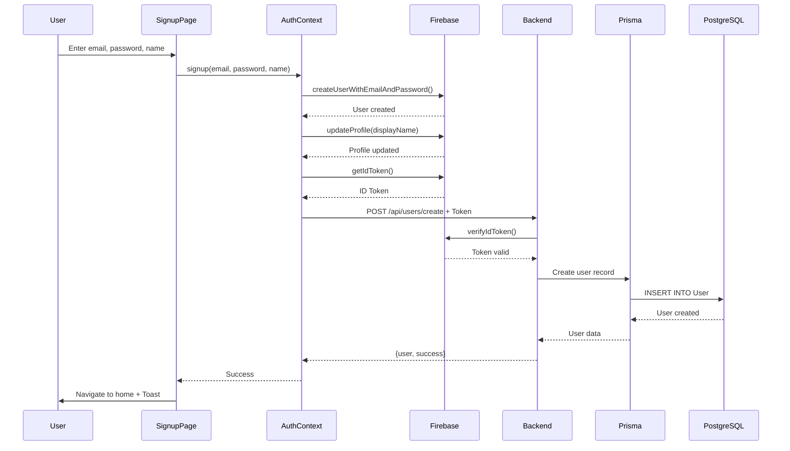
```mermaid
sequenceDiagram
    participant User
    participant SignupPage
    participant AuthContext
    participant Firebase
    participant Backend
    participant Prisma
    participant PostgreSQL
    
    User->>SignupPage: Enter email, password, name
    SignupPage->>AuthContext: signup(email, password, name)
    AuthContext->>Firebase: createUserWithEmailAndPassword()
    Firebase-->>AuthContext: User created
    AuthContext->>Firebase: updateProfile(displayName)
    Firebase-->>AuthContext: Profile updated
    AuthContext->>Firebase: getIdToken()
    Firebase-->>AuthContext: ID Token
    AuthContext->>Backend: POST /api/users/create + Token
    Backend->>Firebase: verifyIdToken()
    Firebase-->>Backend: Token valid
    Backend->>Prisma: Create user record
    Prisma->>PostgreSQL: INSERT INTO User
    PostgreSQL-->>Prisma: User created
    Prisma-->>Backend: User data
    Backend-->>AuthContext: {user, success}
    AuthContext-->>SignupPage: Success
    SignupPage->>User: Navigate to home + Toast
```

---

## 3. Login Flow (Email/Password)

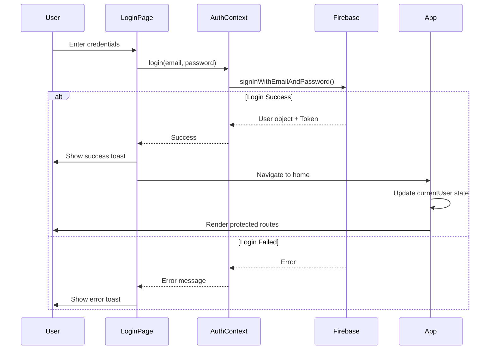
```mermaid
sequenceDiagram
    participant User
    participant LoginPage
    participant AuthContext
    participant Firebase
    participant App
    
    User->>LoginPage: Enter credentials
    LoginPage->>AuthContext: login(email, password)
    AuthContext->>Firebase: signInWithEmailAndPassword()
    
    alt Login Success
        Firebase-->>AuthContext: User object + Token
        AuthContext-->>LoginPage: Success
        LoginPage->>User: Show success toast
        LoginPage->>App: Navigate to home
        App->>App: Update currentUser state
        App->>User: Render protected routes
    else Login Failed
        Firebase-->>AuthContext: Error
        AuthContext-->>LoginPage: Error message
        LoginPage->>User: Show error toast
    end
```

---

## 4. Google OAuth Flow

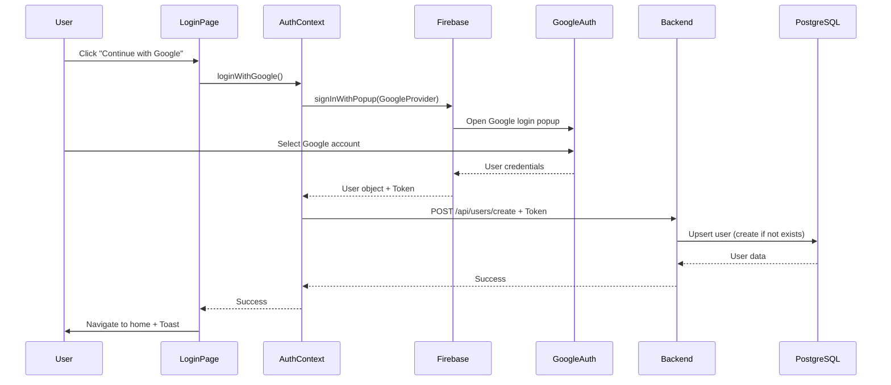
```mermaid
sequenceDiagram
    participant User
    participant LoginPage
    participant AuthContext
    participant Firebase
    participant GoogleAuth
    participant Backend
    participant PostgreSQL
    
    User->>LoginPage: Click "Continue with Google"
    LoginPage->>AuthContext: loginWithGoogle()
    AuthContext->>Firebase: signInWithPopup(GoogleProvider)
    Firebase->>GoogleAuth: Open Google login popup
    User->>GoogleAuth: Select Google account
    GoogleAuth-->>Firebase: User credentials
    Firebase-->>AuthContext: User object + Token
    AuthContext->>Backend: POST /api/users/create + Token
    Backend->>PostgreSQL: Upsert user (create if not exists)
    PostgreSQL-->>Backend: User data
    Backend-->>AuthContext: Success
    AuthContext-->>LoginPage: Success
    LoginPage->>User: Navigate to home + Toast
```

---

## 5. Profile Update Flow

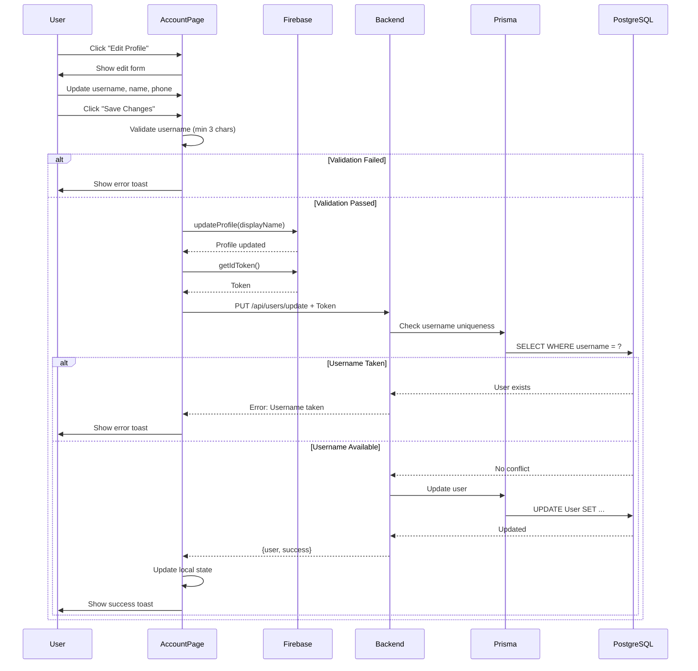
```mermaid
sequenceDiagram
    participant User
    participant AccountPage
    participant Firebase
    participant Backend
    participant Prisma
    participant PostgreSQL
    
    User->>AccountPage: Click "Edit Profile"
    AccountPage->>User: Show edit form
    User->>AccountPage: Update username, name, phone
    User->>AccountPage: Click "Save Changes"
    
    AccountPage->>AccountPage: Validate username (min 3 chars)
    
    alt Validation Failed
        AccountPage->>User: Show error toast
    else Validation Passed
        AccountPage->>Firebase: updateProfile(displayName)
        Firebase-->>AccountPage: Profile updated
        AccountPage->>Firebase: getIdToken()
        Firebase-->>AccountPage: Token
        AccountPage->>Backend: PUT /api/users/update + Token
        Backend->>Prisma: Check username uniqueness
        Prisma->>PostgreSQL: SELECT WHERE username = ?
        
        alt Username Taken
            PostgreSQL-->>Backend: User exists
            Backend-->>AccountPage: Error: Username taken
            AccountPage->>User: Show error toast
        else Username Available
            PostgreSQL-->>Backend: No conflict
            Backend->>Prisma: Update user
            Prisma->>PostgreSQL: UPDATE User SET ...
            PostgreSQL-->>Backend: Updated
            Backend-->>AccountPage: {user, success}
            AccountPage->>AccountPage: Update local state
            AccountPage->>User: Show success toast
        end
    end
```

---

## 6. Shopping Cart Flow

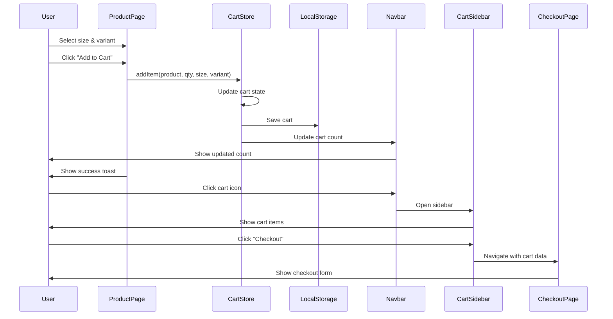
```mermaid
sequenceDiagram
    participant User
    participant ProductPage
    participant CartStore
    participant LocalStorage
    participant Navbar
    participant CartSidebar
    participant CheckoutPage
    
    User->>ProductPage: Select size & variant
    User->>ProductPage: Click "Add to Cart"
    ProductPage->>CartStore: addItem(product, qty, size, variant)
    CartStore->>CartStore: Update cart state
    CartStore->>LocalStorage: Save cart
    CartStore->>Navbar: Update cart count
    Navbar->>User: Show updated count
    ProductPage->>User: Show success toast
    
    User->>Navbar: Click cart icon
    Navbar->>CartSidebar: Open sidebar
    CartSidebar->>User: Show cart items
    
    User->>CartSidebar: Click "Checkout"
    CartSidebar->>CheckoutPage: Navigate with cart data
    CheckoutPage->>User: Show checkout form
```

---

## 7. Order Creation Flow

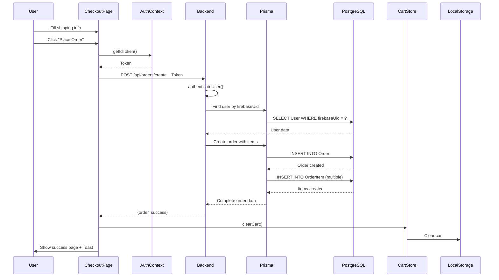
```mermaid
sequenceDiagram
    participant User
    participant CheckoutPage
    participant AuthContext
    participant Backend
    participant Prisma
    participant PostgreSQL
    participant CartStore
    
    User->>CheckoutPage: Fill shipping info
    User->>CheckoutPage: Click "Place Order"
    CheckoutPage->>AuthContext: getIdToken()
    AuthContext-->>CheckoutPage: Token
    CheckoutPage->>Backend: POST /api/orders/create + Token
    Backend->>Backend: authenticateUser()
    Backend->>Prisma: Find user by firebaseUid
    Prisma->>PostgreSQL: SELECT User WHERE firebaseUid = ?
    PostgreSQL-->>Backend: User data
    Backend->>Prisma: Create order with items
    Prisma->>PostgreSQL: INSERT INTO Order
    PostgreSQL-->>Prisma: Order created
    Prisma->>PostgreSQL: INSERT INTO OrderItem (multiple)
    PostgreSQL-->>Prisma: Items created
    Prisma-->>Backend: Complete order data
    Backend-->>CheckoutPage: {order, success}
    CheckoutPage->>CartStore: clearCart()
    CartStore->>LocalStorage: Clear cart
    CheckoutPage->>User: Show success page + Toast
```

---

## 8. Running Club Registration Flow

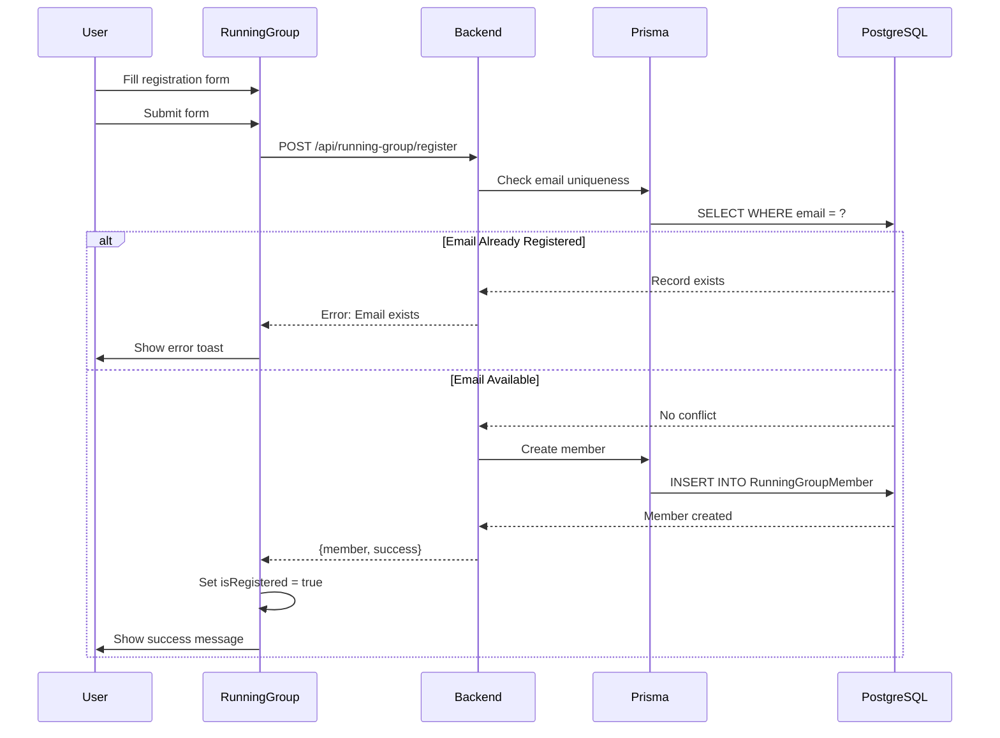
```mermaid
sequenceDiagram
    participant User
    participant RunningGroup
    participant Backend
    participant Prisma
    participant PostgreSQL
    
    User->>RunningGroup: Fill registration form
    User->>RunningGroup: Submit form
    RunningGroup->>Backend: POST /api/running-group/register
    Backend->>Prisma: Check email uniqueness
    Prisma->>PostgreSQL: SELECT WHERE email = ?
    
    alt Email Already Registered
        PostgreSQL-->>Backend: Record exists
        Backend-->>RunningGroup: Error: Email exists
        RunningGroup->>User: Show error toast
    else Email Available
        PostgreSQL-->>Backend: No conflict
        Backend->>Prisma: Create member
        Prisma->>PostgreSQL: INSERT INTO RunningGroupMember
        PostgreSQL-->>Backend: Member created
        Backend-->>RunningGroup: {member, success}
        RunningGroup->>RunningGroup: Set isRegistered = true
        RunningGroup->>User: Show success message
    end
```

---

## 9. Protected Route Flow

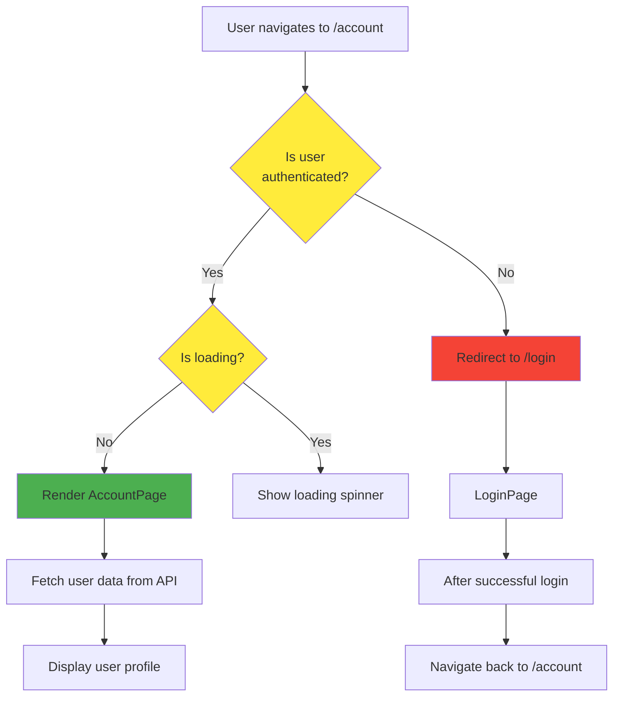
```mermaid
flowchart TD
    Start[User navigates to /account] --> CheckAuth{Is user<br/>authenticated?}
    CheckAuth -->|Yes| CheckLoading{Is loading?}
    CheckAuth -->|No| Redirect[Redirect to /login]
    CheckLoading -->|No| RenderPage[Render AccountPage]
    CheckLoading -->|Yes| ShowLoader[Show loading spinner]
    Redirect --> LoginPage[LoginPage]
    LoginPage --> AfterLogin[After successful login]
    AfterLogin --> Navigate[Navigate back to /account]
    RenderPage --> FetchData[Fetch user data from API]
    FetchData --> DisplayProfile[Display user profile]
    
    style CheckAuth fill:#ffeb3b
    style CheckLoading fill:#ffeb3b
    style RenderPage fill:#4caf50
    style Redirect fill:#f44336
```

---

## 10. Database Schema (Entity Relationship)

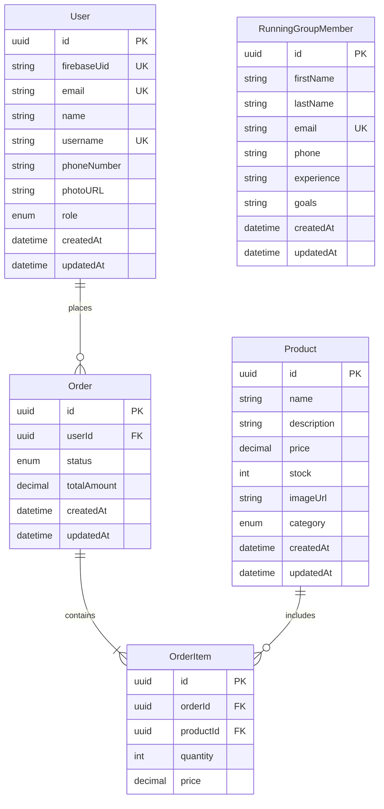
```mermaid
erDiagram
    User ||--o{ Order : places
    User {
        uuid id PK
        string firebaseUid UK
        string email UK
        string name
        string username UK
        string phoneNumber
        string photoURL
        enum role
        datetime createdAt
        datetime updatedAt
    }
    
    Order ||--|{ OrderItem : contains
    Order {
        uuid id PK
        uuid userId FK
        enum status
        decimal totalAmount
        datetime createdAt
        datetime updatedAt
    }
    
    Product ||--o{ OrderItem : includes
    Product {
        uuid id PK
        string name
        string description
        decimal price
        int stock
        string imageUrl
        enum category
        datetime createdAt
        datetime updatedAt
    }
    
    OrderItem {
        uuid id PK
        uuid orderId FK
        uuid productId FK
        int quantity
        decimal price
    }
    
    RunningGroupMember {
        uuid id PK
        string firstName
        string lastName
        string email UK
        string phone
        string experience
        string goals
        datetime createdAt
        datetime updatedAt
    }
```

---

## 11. Component Hierarchy

```mermaid
graph TD
    App[App.tsx<br/>BrowserRouter + AuthProvider]
    App --> Navbar[Navbar.tsx<br/>Global navigation]
    App --> Router{React Router}
    App --> CartSidebar[CartSidebar.tsx<br/>Global cart]
    App --> Toaster[React Hot Toast]
    
    Router --> Home[/ - HomeView]
    Router --> Shop[/shop - ShopView]
    Router --> ProductDetail[/product/:id - ProductDetailView]
    Router --> Ethos[/ethos - Ethos]
    Router --> Space[/space - RunningGroup]
    Router --> Login[/login - LoginPage]
    Router --> Signup[/signup - SignupPage]
    Router --> Account[/account - AccountPage<br/>Protected]
    Router --> Checkout[/checkout - CheckoutPage<br/>Protected]
    
    Home --> Hero[Hero]
    Home --> CategoryShowcase[CategoryShowcase]
    Home --> Featured[FeaturedSection]
    Home --> BrandStory[BrandStory]
    Home --> Stats[StatsSection]
    Home --> Testimonials[TestimonialsSection]
    Home --> Newsletter[NewsletterSection]
    
    Shop --> ProductCard1[ProductCard]
    Shop --> ProductCard2[ProductCard]
    Shop --> ProductCardN[ProductCard ...]
    
    Ethos --> FlowArt[FlowArt]
    FlowArt --> FlowSection1[FlowSection]
    FlowArt --> FlowSection2[FlowSection]
    FlowArt --> FlowSectionN[FlowSection ...]
    
    Account --> ProfileTab[Profile Tab]
    Account --> OrdersTab[Orders Tab]
    Account --> WishlistTab[Wishlist Tab]
    Account --> SettingsTab[Settings Tab]
    
    style App fill:#e3f2fd
    style Router fill:#fff3e0
    style Account fill:#ffebee
    style Checkout fill:#ffebee
```

---

## 12. State Management Architecture

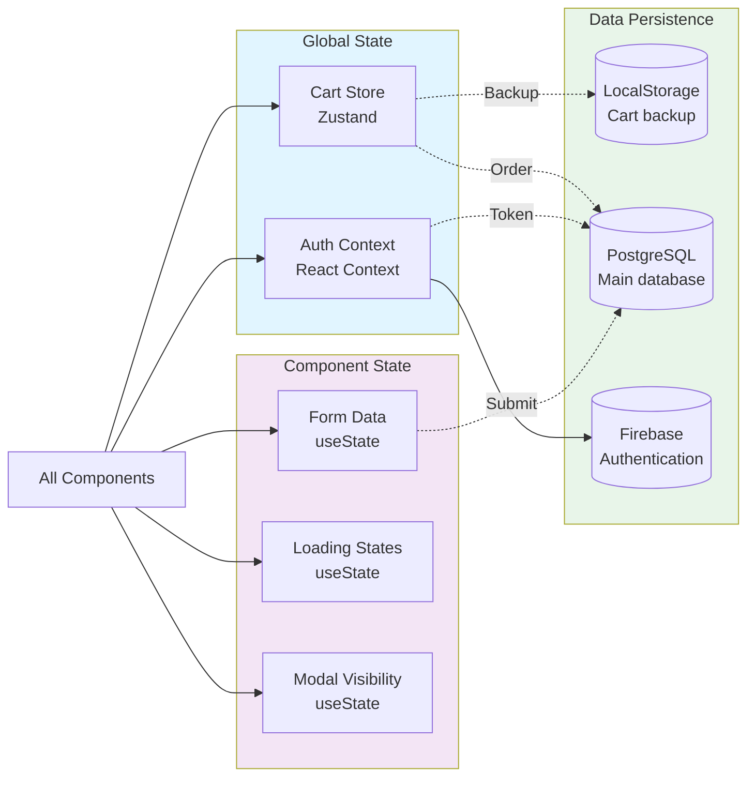
```mermaid
graph LR
    subgraph Global["Global State"]
        CartStore[Cart Store<br/>Zustand]
        AuthContext[Auth Context<br/>React Context]
    end
    
    subgraph Local["Component State"]
        FormData[Form Data<br/>useState]
        Loading[Loading States<br/>useState]
        Modal[Modal Visibility<br/>useState]
    end
    
    subgraph Persistence["Data Persistence"]
        LocalStorage[(LocalStorage<br/>Cart backup)]
        PostgreSQL[(PostgreSQL<br/>Main database)]
        Firebase[(Firebase<br/>Authentication)]
    end
    
    CartStore -.Backup.-> LocalStorage
    CartStore -.Order.-> PostgreSQL
    AuthContext --> Firebase
    AuthContext -.Token.-> PostgreSQL
    FormData -.Submit.-> PostgreSQL
    
    Components[All Components] --> CartStore
    Components --> AuthContext
    Components --> FormData
    Components --> Loading
    Components --> Modal
    
    style Global fill:#e1f5ff
    style Local fill:#f3e5f5
    style Persistence fill:#e8f5e9
```

---

## 13. API Request Flow

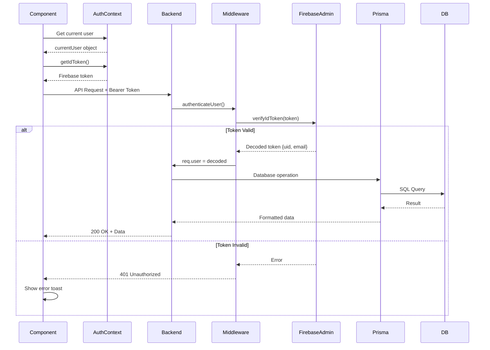
```mermaid
sequenceDiagram
    participant Component
    participant AuthContext
    participant Backend
    participant Middleware
    participant FirebaseAdmin
    participant Prisma
    participant DB
    
    Component->>AuthContext: Get current user
    AuthContext-->>Component: currentUser object
    Component->>AuthContext: getIdToken()
    AuthContext-->>Component: Firebase token
    Component->>Backend: API Request + Bearer Token
    Backend->>Middleware: authenticateUser()
    Middleware->>FirebaseAdmin: verifyIdToken(token)
    
    alt Token Valid
        FirebaseAdmin-->>Middleware: Decoded token {uid, email}
        Middleware->>Backend: req.user = decoded
        Backend->>Prisma: Database operation
        Prisma->>DB: SQL Query
        DB-->>Prisma: Result
        Prisma-->>Backend: Formatted data
        Backend-->>Component: 200 OK + Data
    else Token Invalid
        FirebaseAdmin-->>Middleware: Error
        Middleware-->>Component: 401 Unauthorized
        Component->>Component: Show error toast
    end
```

---

## 14. User Journey Map

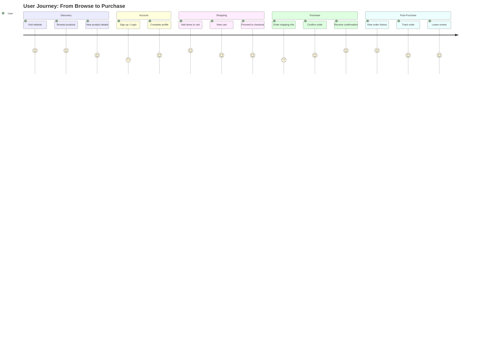
```mermaid
journey
    title User Journey: From Browse to Purchase
    section Discovery
      Visit website: 5: User
      Browse products: 5: User
      View product details: 4: User
    section Account
      Sign up / Login: 3: User
      Complete profile: 4: User
    section Shopping
      Add items to cart: 5: User
      View cart: 4: User
      Proceed to checkout: 4: User
    section Purchase
      Enter shipping info: 3: User
      Confirm order: 4: User
      Receive confirmation: 5: User
    section Post-Purchase
      View order history: 5: User
      Track order: 4: User
      Leave review: 4: User
```

---

## 15. Deployment Architecture

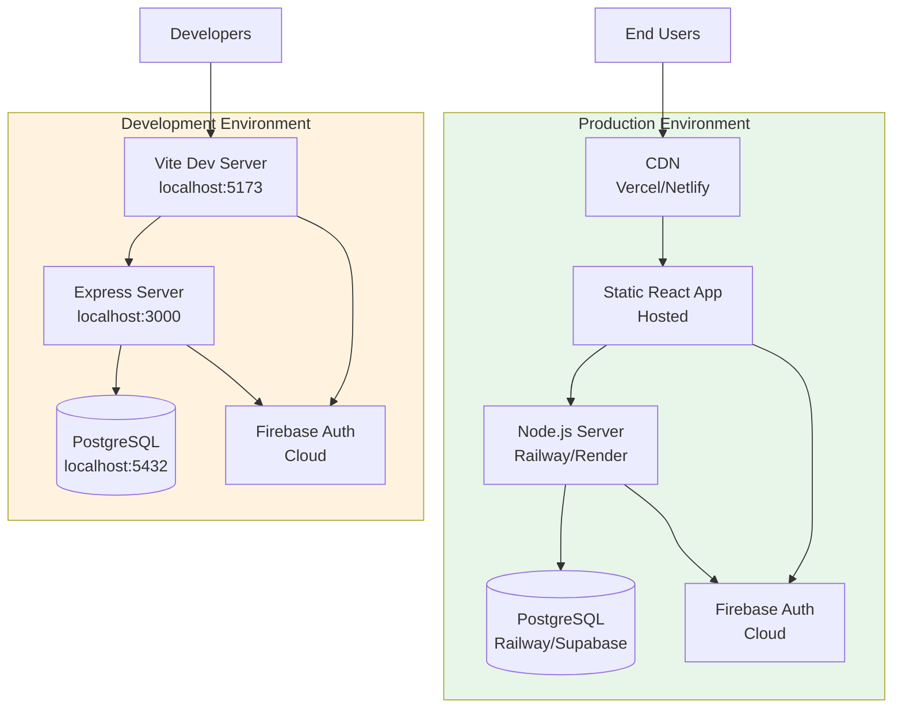
```mermaid
graph TB
    subgraph Production["Production Environment"]
        CDN[CDN<br/>Vercel/Netlify]
        Frontend[Static React App<br/>Hosted]
        Backend[Node.js Server<br/>Railway/Render]
        DB[(PostgreSQL<br/>Railway/Supabase)]
        Firebase[Firebase Auth<br/>Cloud]
    end
    
    subgraph Development["Development Environment"]
        Vite[Vite Dev Server<br/>localhost:5173]
        Express[Express Server<br/>localhost:3000]
        LocalDB[(PostgreSQL<br/>localhost:5432)]
        FirebaseDev[Firebase Auth<br/>Cloud]
    end
    
    Users[End Users] --> CDN
    CDN --> Frontend
    Frontend --> Backend
    Backend --> DB
    Frontend --> Firebase
    Backend --> Firebase
    
    Developers[Developers] --> Vite
    Vite --> Express
    Express --> LocalDB
    Vite --> FirebaseDev
    Express --> FirebaseDev
    
    style Production fill:#e8f5e9
    style Development fill:#fff3e0
```

---

## 16. Error Handling Flow

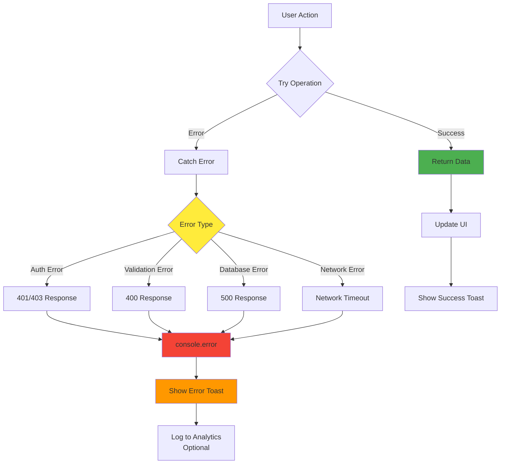
```mermaid
flowchart TD
    Start[User Action] --> Try{Try Operation}
    Try -->|Success| Success[Return Data]
    Try -->|Error| CatchError[Catch Error]
    
    CatchError --> CheckType{Error Type}
    
    CheckType -->|Auth Error| AuthError[401/403 Response]
    CheckType -->|Validation Error| ValidationError[400 Response]
    CheckType -->|Database Error| DBError[500 Response]
    CheckType -->|Network Error| NetworkError[Network Timeout]
    
    AuthError --> LogError[console.error]
    ValidationError --> LogError
    DBError --> LogError
    NetworkError --> LogError
    
    LogError --> ShowToast[Show Error Toast]
    ShowToast --> LogAnalytics[Log to Analytics<br/>Optional]
    
    Success --> UpdateUI[Update UI]
    UpdateUI --> ShowSuccessToast[Show Success Toast]
    
    style CheckType fill:#ffeb3b
    style LogError fill:#f44336
    style ShowToast fill:#ff9800
    style Success fill:#4caf50
```

---

## 17. Authentication State Machine

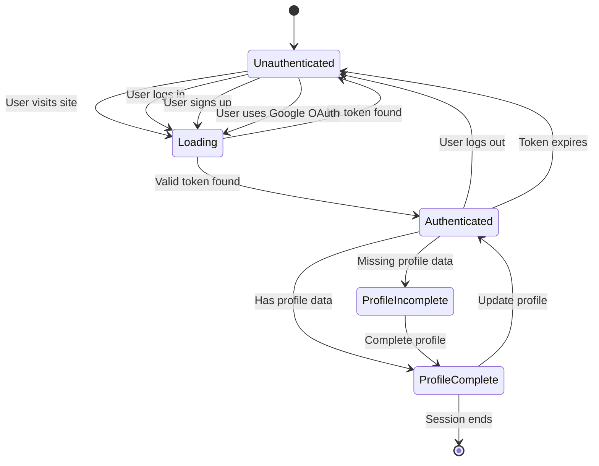
```mermaid
stateDiagram-v2
    [*] --> Unauthenticated
    
    Unauthenticated --> Loading: User visits site
    Loading --> Unauthenticated: No token found
    Loading --> Authenticated: Valid token found
    
    Unauthenticated --> Loading: User logs in
    Unauthenticated --> Loading: User signs up
    Unauthenticated --> Loading: User uses Google OAuth
    
    Authenticated --> ProfileComplete: Has profile data
    Authenticated --> ProfileIncomplete: Missing profile data
    
    ProfileComplete --> Authenticated: Update profile
    ProfileIncomplete --> ProfileComplete: Complete profile
    
    Authenticated --> Unauthenticated: User logs out
    Authenticated --> Unauthenticated: Token expires
    
    ProfileComplete --> [*]: Session ends
```

---

## 18. Cart State Machine

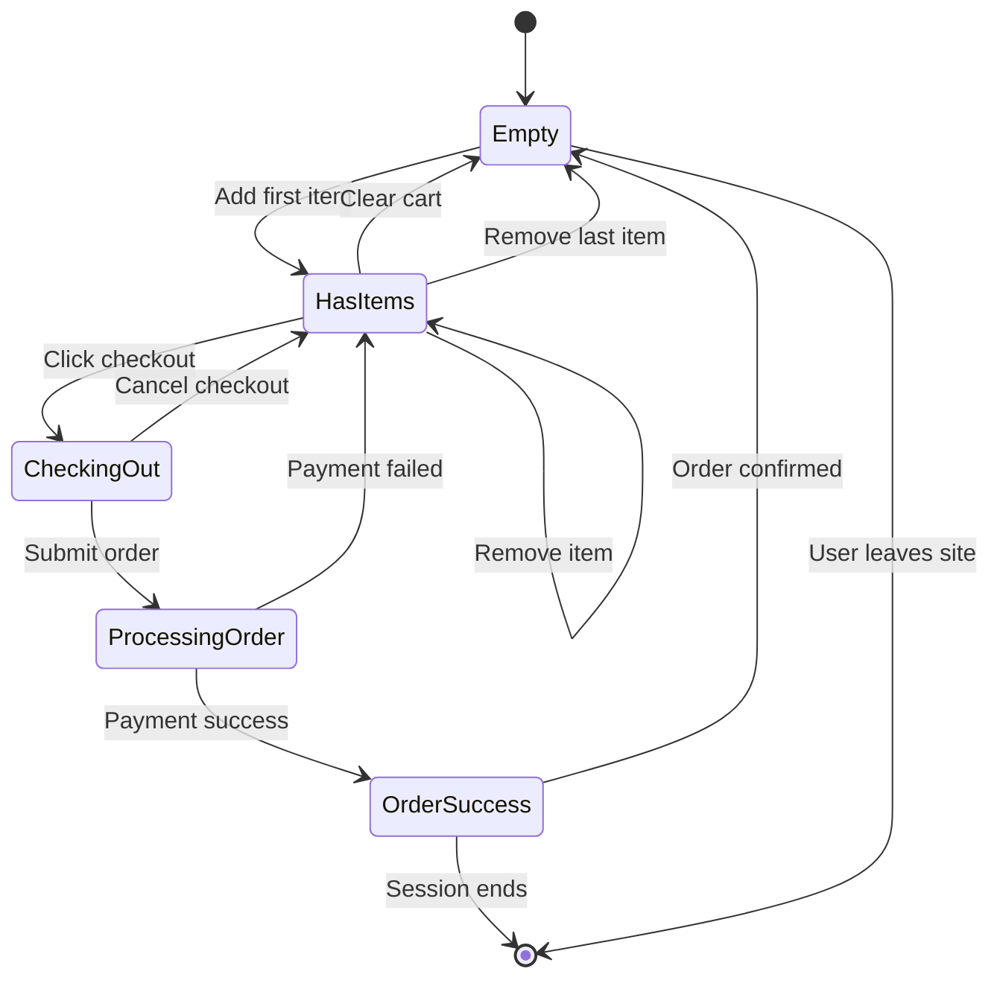
```mermaid
stateDiagram-v2
    [*] --> Empty
    
    Empty --> HasItems: Add first item
    HasItems --> Empty: Clear cart
    HasItems --> HasItems: Add more items
    HasItems --> HasItems: Update quantity
    HasItems --> HasItems: Remove item
    HasItems --> Empty: Remove last item
    
    HasItems --> CheckingOut: Click checkout
    CheckingOut --> HasItems: Cancel checkout
    CheckingOut --> ProcessingOrder: Submit order
    
    ProcessingOrder --> OrderSuccess: Payment success
    ProcessingOrder --> HasItems: Payment failed
    
    OrderSuccess --> Empty: Order confirmed
    OrderSuccess --> [*]: Session ends
    
    Empty --> [*]: User leaves site
```

---

## 19. Data Flow: Complete Purchase Journey

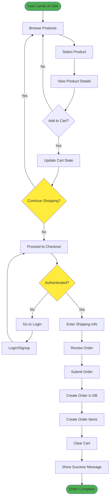
```mermaid
flowchart TD
    Start([User Lands on Site]) --> Browse[Browse Products]
    Browse --> SelectProduct[Select Product]
    SelectProduct --> ViewDetails[View Product Details]
    ViewDetails --> AddToCart{Add to Cart?}
    
    AddToCart -->|No| Browse
    AddToCart -->|Yes| UpdateCart[Update Cart State]
    UpdateCart --> ContinueShopping{Continue Shopping?}
    
    ContinueShopping -->|Yes| Browse
    ContinueShopping -->|No| Checkout[Proceed to Checkout]
    
    Checkout --> CheckAuth{Authenticated?}
    CheckAuth -->|No| Login[Go to Login]
    Login --> Authenticate[Login/Signup]
    Authenticate --> Checkout
    
    CheckAuth -->|Yes| EnterShipping[Enter Shipping Info]
    EnterShipping --> ReviewOrder[Review Order]
    ReviewOrder --> SubmitOrder[Submit Order]
    
    SubmitOrder --> CreateOrder[Create Order in DB]
    CreateOrder --> CreateItems[Create Order Items]
    CreateItems --> ClearCart[Clear Cart]
    ClearCart --> ShowSuccess[Show Success Message]
    ShowSuccess --> End([Order Complete])
    
    style Start fill:#4caf50
    style End fill:#4caf50
    style CheckAuth fill:#ffeb3b
    style ContinueShopping fill:#ffeb3b
```

---

## 20. Security Architecture

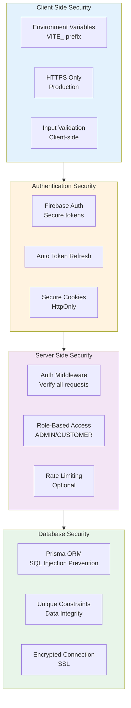
```mermaid
graph TB
    subgraph Client["Client Side Security"]
        EnvVars[Environment Variables<br/>VITE_ prefix]
        HTTPS[HTTPS Only<br/>Production]
        InputValidation[Input Validation<br/>Client-side]
    end
    
    subgraph Authentication["Authentication Security"]
        FirebaseAuth[Firebase Auth<br/>Secure tokens]
        TokenRefresh[Auto Token Refresh]
        SecureCookies[Secure Cookies<br/>HttpOnly]
    end
    
    subgraph Server["Server Side Security"]
        AuthMiddleware[Auth Middleware<br/>Verify all requests]
        RBAC[Role-Based Access<br/>ADMIN/CUSTOMER]
        RateLimit[Rate Limiting<br/>Optional]
    end
    
    subgraph Database["Database Security"]
        Prisma[Prisma ORM<br/>SQL Injection Prevention]
        Constraints[Unique Constraints<br/>Data Integrity]
        Encryption[Encrypted Connection<br/>SSL]
    end
    
    Client --> Authentication
    Authentication --> Server
    Server --> Database
    
    style Client fill:#e3f2fd
    style Authentication fill:#fff3e0
    style Server fill:#f3e5f5
    style Database fill:#e8f5e9
```

---

## How to View These Diagrams

### Online Viewers:
1. **Mermaid Live Editor**: https://mermaid.live/
   - Copy any diagram code
   - Paste into the editor
   - View and export

2. **GitHub/GitLab**:
   - Push this file to your repository
   - Diagrams render automatically

3. **VS Code Extension**:
   - Install "Markdown Preview Mermaid Support"
   - Open this file
   - Preview with Ctrl+Shift+V

### Export Options:
- PNG image
- SVG vector
- PDF document

---

**Last Updated**: June 10, 2026
**Total Diagrams**: 20
**Format**: Mermaid.js
